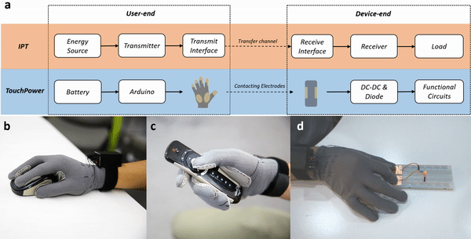

Currently, most interaction interfaces are designed for powerful and independent computing devices, which adopts a device-centered design approach. A human-centered pervasive interface, however, requires seamless interconnection among devices for resource redistribution. By allocating energy, computation, and interaction resources based on needs, the design of the interfaces can be more flexible and thus truly be woven into the fabric of everyday life. 
<!-- The power and information interconnections are the underlying infrastructure, on top of which interaction techniques can be implemented.   -->

<figure>
  
  <figcaption><i>Figure 1. TouchPower is an Interaction-based Power Transfer (IPT) technique. It transfers DC power through contact between electrodes on the glove and the object. </i></figcaption>
</figure>

 Power interconnection between few on-body wearables and many off-body objects can significantly reduce user maintenance efforts. I invented the concept of __Interaction-based Power Transfer (IPT)__, which transfers on-body energy to off-body devices leveraging the contact and close distance between user and object during interaction. IPT is especially suitable for devices that only need to be powered during interaction (e.g. mouse, remote controller). The concept was validated with a glove-based IPT prototype __TouchPower__ (Figure 1), which transfers DC power through contacts of electrodes on the glove and objects. With careful design of the transfer interface, energy can be distributed without affecting the original interaction. 

<figure>
  
  <figcaption><i>Figure 2. Tap-to-Pair enables wireless device association with minimal resource requirements. </i></figcaption>
</figure>

It is challenging to establish information interconnection between resource-constrained IoT devices. __Tap-to-Pair__ provides a spontaneous device association experience based on temporal correlation of two signals. Users can tap the initiating device to induce periodic wireless signal strength changes, which is then correlated with the blinking patterns of target devices for association. In a follow up work, I proposed a 2D design space and design guidelines for blinking patterns by applying Bayesian models of user tapping behaviors. Such optimization enables the technique to support robust selection among more targets. 

*Go to* [*Sensing Tags*](/project/sensing)  
*Go to* [*Finger Wearables*](/project/smartring)  
