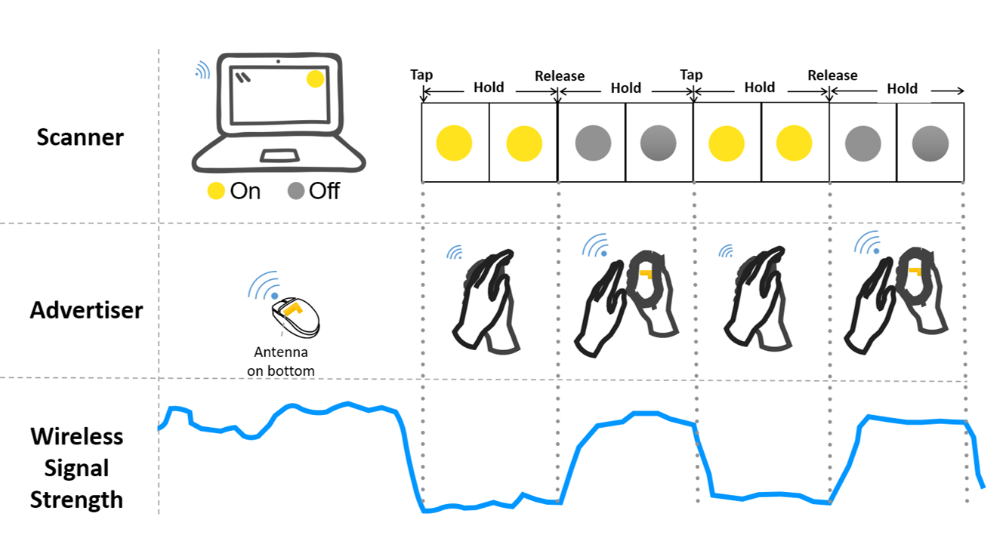

<figure>
  
  <figcaption><i>Figure 1. TouchPower is an Interaction-based Power Transfer (IPT) technique. It transfers DC power through contact between electrodes on the glove and the object. </i></figcaption>
</figure>

To eliminate power maintenance demands, a power link can be established between on-body devices to off-body objects to transfer power. __TouchPower__ is an interaction-based power transfer technique that transfers on-body energy to off-body devices only during interaction. It is based on the observation that many devices do not need to be powered up when not used (e.g. computer mouse, remote controller). By adding conductive contacts on different parts of the hand, the power transfer can happen during the interaction without disrupting the original efforts. Other power transfer systems are also discussed.  

<figure>
  
  <figcaption><i>Figure 2. Tap-to-Pair enables wireless device association with minimal resource requirements. </i></figcaption>
</figure>

I also designed novel cross-device association techniques, which establish communication links between devices. __Tap-to-Pair__ provides a spontaneous device association experience by leveraging the wireless signal. To further understand the synchronous pairing method, we proposed a 2D design dimension and corresponding design spaces for the blinking patterns. We also demonstrated that such technique can work without visual blinking patterns when there are only few target devices. 

*Go to* [*Sensing Tags*](/project/sensing)  
*Go to* [*Finger Wearables*](/project/smartring)  
