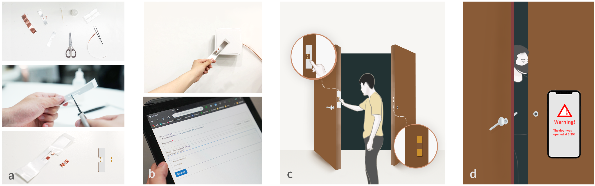

 Interactive everyday objects are "technologies that weave themselves into the fabric of everyday life", which can create an immersive interaction experience. However, users can still distinguish such computing enhanced objects, since they are usually expensive and require extra maintenances (e.g. replace batteries). Users can also be reluctant to replace existing objects for aesthetic or sentimental reasons. To overcome such limitations, I invent passive wireless sensors that can be easily deployed on existing everyday objects. The sensor's many hardware components (e.g. power source, RF oscillator) and computation procedure (e.g. signal digitalization) are offloaded to one remote device. The cost, size, and power consumption of the sensors are then minimized. The small and thin form factor and the passive nature make them suitable for ubiquitous deployment on existing infrastructure and objects. 

<figure>
  
  <figcaption><i>Figure 1. BitID sensors can be easily made (a), registered (b), and deployed (c) on a door to detect intrusion (d).</i></figcaption>
</figure>
<video width="320" height="240" controls muted autoplay loop>
<source src="./bitid_room.mp4" type="video/mp4">
</video>

In __BitID__, I propose to modify commercial-off-the-shelf (COTS) low-cost and passive UHF RFID tags to behave as sensors. By attaching shorting stubs to exposed antenna around the chip, the tag’s readability is modulated by the connection status of the shorting stubs. Users can easily make BitID sensors using only copper tape and scissors. When properly deployed, a BitID sensor can detect the binary states of an object. We deploy BitID sensors on six objects in a room to show its high scalability. The codes for the BitID sensing system is open sourced on [GitHub](https://github.com/AlexFxw/BitID). The RFID reader used in BitID is not widely available yet. So I look into opportunities to leverage more accessible computers (e.g. smart phone, smart ring) to power and compute for the resource-constrained sensors. In __FlexTouch__, conductive tapes are attached to the touch screen of a smart phone to enable large-scale sensing (e.g. Yoga mat for posture detection). In __ThermalRing__, I used a smart ring with a low-power thermal camera to recognize passive aluminum stickers for quick access. 

*Go to* [*Finger Wearables*](/project/smartring)  
*Go to* [*Interconnection Techniques*](/project/links) 
