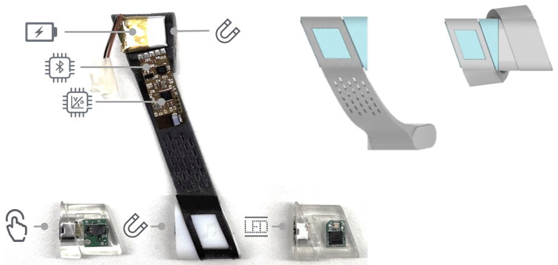
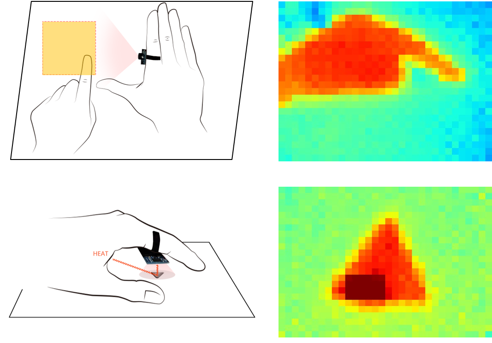

Wearable devices are close and readily available to users, which enables a spontaneous and consistent interaction experiences. Finger wearables can support a richer set of input gestures thanks to the dexterity of fingers. Also, they are usually the closet on-body devices to the interacting object, which makes them ideal candidates for resource sharing. However, finger wearables are challenging to design due to size constrains. The small size further limits the available computing, I/O, and power resources, which can impact interaction experience.

<figure>
  
  <figcaption><i>Figure 1. Users wrap the flexible ring band around the finger and align the magnetic connectors to wear the ring. I/O module are also connected with the main board and battery through the connectors. </i></figcaption>
</figure>

To overcome the resource constrains, I explored modular design for a smart ring (Figure 1). Instead of integrating various I/O functions into one piece of hardware, __ModularRing__ uses switchable I/O modules for interaction. The novel wearing design allows the I/O module to be separated from the wireless MCU and battery. Users can then switch the I/O module based on needs, and combine multiple rings with different I/O modules to create advanced interfaces. For example, a ring with a microphone module and a ring with a speaker module can work together as an audio interface. ModularRing won Finalist of 2018 Global Innovation Competition and is open sourced on [GitHub](https://github.com/saintnever/ModularRing). 

<figure>
  
  <figcaption><i>Figure 2. ThermalRing can recognize gestural inputs on flat surfaces and image passive tags by leveraging the heat radiated from hand. </i></figcaption>
</figure>

In __ThermalRing__, I proposed a novel I/O module-a low-power low-resolution thermal camera for gesture and tag inputs. ThermalRing analyzes the heat silhouette of the hand to recognize drawing gestures on flat surfaces. I also proposed ThermalTag, passive tags that can be easily made using materials with high heat reflectivity (e.g. copper tape). When covered by hand, ThermalTag reflects the heat radiated from the hand and thus can be imaged. This demonstrates how the on-body wearables can work together with off-body tags for more interaction possibilities.

*Go to* [*Sensing Tags*](/project/sensing)  
*Go to* [*Interconnection Techniques*](/project/links) 